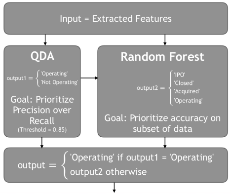

# Startup Acquisition Analysis and Prediction  

---  
Any company and/or startup, old or new, is prone to corrupt and fail at any moment. In this project, we aim to predict whether the company is operating or not based on a given set of features.  

---  
## Understanding the dataset  
The dataset is a combination of numerical and categorical data that is supposed to classify whether a certain company or organization will be operating or closed.  
  
The data consists of basic information, like: *name, funding, tags, ...etc*.  
  
The label of the dataset is the acquisition status of each company: 
`Operating`, `IPO`, `Acquired`, and `Closed`.  

---  
## Preprocessing  

#### Data cleaning  
***1. deleting irrelevant and redundant information:***  
Upon inspection, a huge chunk of the dataset was found to be redundant/repeated and irrelevant to the prediction.  
* 'id', 'Unnamed: 0.1', 'entity_type', 'entity_id', 'parent_id'  
* 'region','city','state_code', 'created_by', 'created_at', 'updated_at'  
* 'domain', 'homepage_url', 'twitter_username', 'logo_url', 'logo_width', 'logo_height'  
* 'short_description', 'description', 'overview','tag_list', 'name', 'normalized_name'  
* 'invested_companies', 'permalink'  
  
Duplicate values provide high bias, therefore were deleted.  
  
***2. removing noise and unreliable data:***  
Columns with a high percentage of null values were dropped.  
Columns with *some* instances of null values had those instances imputed from the dataset.  
Outliers for `'funding_total_usd'` and `'funding_rounds'` were deleted using the IQR method *(Inter-Quantile Range)*.  
  
#### Data transformation  
***1. changes in original data:***  
Seeing as there were a lot of dates in our data, they were converted to only years instead of very intricate dates.
* 'founded_at', 'closed_at', 'first_funded_at', 'last_funding_at', 'first_milestone_at', 'last_milestone_at'  
  
We used One-Hot Encoding to generalize categorical data present in 'category_code' and 'country_code'.  
  
***2. creating new variables:***  
Two new features were created based on other features: 'isClosed' and 'active_days':  
* 'isClosed' = 0 if 'status' = 'operating' or 'ipo'  
* 'isClosed' = 1 if 'status' = 'acquired' or 'closed'  
* 'active_days' calculated using 'closed_at', 'founded_at', and 'status' to calculate the age of the company  
  
***3. other transformations:***  
* deleteing 'closed_at' column  
* filling null values of the numerical with the mean values of each column  
* dropping columns with null values, i.e. 'first_investment_at', 'last_investment_at', and 'state_code'  

---  
## EDA and Feature Engineering  

#### factorizing the data  
Using the `.factorize()` method to transform the dataset into numerical type in order to find the correlations between them.  

#### mutual information  
Using MI to detect the most important features in the data.  
It is more efficient than the correlation as it doesn't assume a linear relationship, instead it measures the level of uncertainty between two features.  
'first_funding_at' and 'last_funding_at' have the highest scores.  

#### univariate analysis  
Reached almost the same results as MI  
***using SelectKBest method:***
* select the independent features which have the strongest relationship with the dependent feature  
* feature with the highest score will be more related to the dependent feature  

***using ExtraTreesClassifier method:***  
* helps to give the importance of each independent feature with a dependent feature  
* higher score means it's more important/relevant towards output variable  

#### standardization  
Used when all features are having high values, not 0 and 1.  
The mean of the independent features is 0 and the standard deviation is 1.  

#### pca  
Using standardized data to perform pca in order to find the principal components contributing to the label data.  
`pca = PCA(n_components=2)`  

---  
## Choosing Classification Models  

In order to choose the models wisely, a few metrics were considered for the model evaluation:  
**Accuracy , Precision , Recall, F1 Score, and Support**  
* *Accuracy:* number of correctly classified prediction to the total number of prediction.  
* *Precision:* ratio of true psoitives _(TP)_ to total positives _(TP + FP)_  
* *Recall:* ratio of true positives _(TP)_ to all positives in ground truth _(TP + FN)_  
* *F1 score:* harmonic mean of Precision and Recall  

The classifiers integrated in our model are: **QDA, and Random Forest Classifier**  
#### *QDA - Quadratic Discriminant Analysis*
* Method designed to separate two or more classes based on a combination of features in a normal ditribution, where it assumes each feature has its own covariance matrix.  
* QDA is more flexible with high variance data.  
* QDA uses a classifier with a quadratic decision boundary, where each class is fitted with a Gaussian density.  
* This classifier was mainly used to classify between 2 classes only, `Operating` and `Not Operating`.  

#### *Random Forest Classifier*
* Classification algorithm consisting of a large number of individual decision trees that operate as an ensemble.  
* Each tree predicts a decision/class, and the decision with the most votes becomes the final prediction.  
* Low correlation between data features helps this ensemble reach better scores.  
* This classifier was used to classify between all 4 classes, `Operating`, `IPO`, `Acquired`, and `Closed`.  

---  
## Building Pipelines  
Pipelines provide clear and understandable code. The process of creating a pipeline that was used goes as follows:  
```python
from sklearn.pipeline import Pipeline

pipeline = Pipeline([
    ('stdscaler', stdscaler),
    ('pca', pca),
    ('classifier', clf)
])
```  
**1. `stdscaler` Standardization**  
using standardization to limit the feature data to improve training and testing scores.  
**2. `pca` Principal Component Analysis**  
using pca to limit the _important_ features that would have the greatest weights while training.  
**3. `clf` Classifier**  
using either QDA or Random Forest Classifier to create said pipeline.
* ***QDA*** &rarr; `Operating` and `Not Operating`.  
* ***Random Forest*** &rarr; `Operating`, `IPO`, `Acquired`, and `Closed`.  

#### *QDA Pipeline*  
* `clf = QuadraticDiscriminantAnalysis()`  
* predict between `Operating`, and `Not Operating`.  
* the training labels for the `y` variable are represented in the `isClosed` column in our data.  
```python
model_qda.fit(X_train, yClosed_train)
```  
* accuracy reaching 90%.  

#### *Random Forest Classifier Pipeline*  
* `clf = RandomForestClassifier(random_state=0)`
* predict between `Operating`, `IPO`, `Acquired`, and `Closed`.  
* the training labels for the `y` variable are represented in the `status` column in our data.  
```python
model_rf.fit(X_train, yStatus_train)
```  
* accuracy reaching 89%.  

---  
## Deployment  
Our web-app can be accessed through this link [startup-acquistion-status-app](https://technocolabs-flask-app.herokuapp.com/).  
  
#### Flask  
A framework that helps create web applications for your models while using simple python code.  
Our app allows the user to enter a few pieces of information about the company/startup of interest:  
`Founded on the year`, `Funding Rounds`, `First Funding At`, `Last Funding At`, `Total Funding in USD`, `First Milestone At`, `Last Milestone At`, `Milestones`, `Relationships`.  
The app takes the data and predicts based on the classifiers QDA and Random Forest.  
  
  
#### Heroku  
In order to deploy our model, [Heroku](https://www.heroku.com/) was used. Finally our model is hosted online and can be accessed through this link [startup-acquistion-status-app](https://technocolabs-flask-app.herokuapp.com/).  

---  